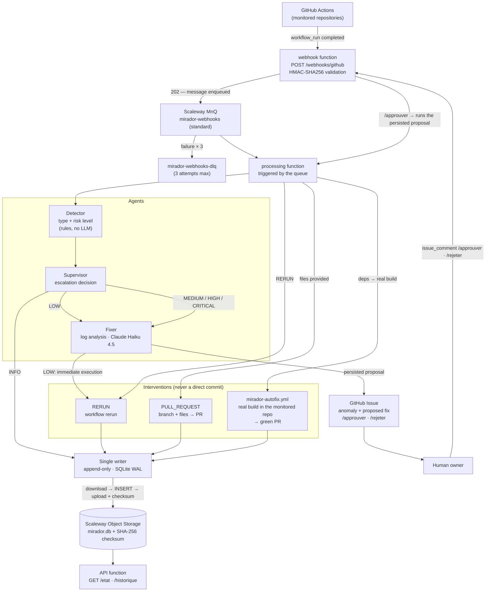

🇬🇧 **English** | [🇫🇷 Français](README.fr.md)

# Mirador

Autonomous monitoring of GitHub Actions CI/CD pipelines with AI agents.

Mirador listens to GitHub Actions events, detects anomalies, classifies them by risk level and applies automatic fixes — or escalates to human validation for critical cases.

**Status**: deployed and validated end-to-end in production on real repositories — a failure is detected, an Issue carrying the proposed fix is opened, then `/approuver` turns it into an actual pull request.

> The bot's commands and messages are in French (`/approuver` = approve, `/rejeter` = reject).

---

## Architecture



### Risk levels and actions

The level is decided by the **Detector** (deterministic rules, no LLM call); the **Supervisor** derives the action from it.

| Level | Trigger | Action |
|--------|-------------|--------|
| `INFO` | Normal event | Logging only |
| `LOW` | Isolated failure, known pattern | Immediate automatic intervention |
| `MEDIUM` | Unexpected failure | **Issue** + awaits validation |
| `HIGH` | Timeout, or impact on the default branch | **Issue** + awaits validation |
| `CRITICAL` | Production incident | **Issue** + awaits validation |

`MEDIUM` does open an Issue, just like `HIGH` and `CRITICAL`: only the wording differs. Only `LOW` acts without asking a human.

### Human validation loop

1. Escalation calls the Fixer, **persists** its proposal in the audit log, and opens an Issue showing it.
2. An owner comments `/approuver` or `/rejeter <reason>` — the identity is checked against the repository's `responsables` (owners).
3. `/approuver` reloads the persisted proposal and **actually executes it**:
   - **Go dependency update** → triggers `mirador-autofix.yml` in the monitored repository, which regenerates `go.mod`/`go.sum` through a **real build** and opens the PR (the only way to get a fix that passes CI — `go.sum` cannot be computed without a build);
   - **files provided** → creates the `mirador/fix-<run>` branch, writes the files, opens the PR;
   - otherwise → documentation PR (`MIRADOR-FIX.md`) for a human to complete.
4. If execution fails, the approval stands: the issue is closed with an honest message rather than crashing.

**If the Fixer is unavailable** (API outage, credits exhausted), the Issue is opened **anyway**, flagged "Analyse indisponible" (analysis unavailable). Detection does not depend on Claude being available.

---

## Tech stack

- **Runtime**: Python 3.12 — Scaleway Serverless Functions (scale-to-zero). The runtime is **Alpine/musl**: dependencies are vendored as `musllinux` wheels in the zip, because the low-level deployment does not build `requirements.txt`.
- **Message queue**: Scaleway MnQ (SQS-compatible, boto3) — `mirador-webhooks` + its DLQ. **Standard** queue, not FIFO: Scaleway `scw_sqs` triggers do not consume FIFO queues. Idempotency therefore relies on deduplication by `delivery_id`.
- **Storage**: SQLite in WAL mode, persisted in a Scaleway Object Storage bucket (~€0.02/month) — append-only audit guaranteed by a single writer (`max-scale=1`, INSERT-only, SHA-256 checksum).
- **GitHub auth**: GitHub App — RS256 JWT, short-lived installation tokens (requires `PyJWT[crypto]`).
- **AI agent**: `anthropic` SDK — Claude Haiku 4.5, structured `json_schema` output.
- **API**: FastAPI — incoming webhooks + state/history queries.
- **Observability**: JSON `structlog` + a UUID `correlation_id` on every event.

---

## Running locally

```bash
python3.12 -m venv .venv
.venv/bin/pip install -e ".[dev]"
.venv/bin/pytest tests/ -v
```

Developed with **strict TDD**: the test fails before the code exists.

---

## Configuration and deployment

**Deployments go through GitHub Actions workflows only** — never from a workstation. The scripts in `infra/scaleway/` remain useful for diagnostics, but must not be used to write to production.

| Workflow | Role | Trigger |
|---|---|---|
| `deploy.yml` | Updates the functions' **code** | Push to `master` touching `src/`, `handler.py`, `requirements.txt` (or manually) |
| `deploy-config.yml` | Sets the **environment + secrets** | Manually, after changing a Variable or a Secret |

The configuration's source of truth is the repository's **GitHub Actions Variables and Secrets** (Settings → Secrets and variables → Actions).

Variables (non-sensitive): `MIRADOR_DEPOTS`, `BUCKET_NAME`, `S3_ENDPOINT_URL`, `SQS_ENDPOINT_URL`, `SQS_QUEUE_URL`, `SCALEWAY_REGION`, `APP_ID`.

Secrets: `APP_PRIVATE_KEY`, `WEBHOOK_SECRET`, `ANTHROPIC_API_KEY`, `SCALEWAY_S3_ACCESS_KEY`, `SCALEWAY_S3_SECRET_KEY`, `MNQ_ACCESS_KEY`, `MNQ_SECRET_KEY`, plus `SCW_DEPLOY_ACCESS_KEY`, `SCW_DEPLOY_SECRET_KEY`, `SCW_PROJECT_ID` for deployment.

> The `GITHUB_` prefix is reserved by GitHub Actions, hence `APP_ID` / `APP_PRIVATE_KEY` on the GitHub side, which `deploy-config.yml` maps to `GITHUB_APP_ID` / `GITHUB_APP_PRIVATE_KEY` on the Scaleway side. Likewise, Scaleway Functions reserves the `SCW_` prefix: variables set on the functions use `SCALEWAY_`.

> MnQ credentials (`MNQ_*`, message queue) are **distinct** from Object Storage credentials (`SCALEWAY_S3_*`, bucket) and from the deployment key (`SCW_DEPLOY_*`, CI). These are three different key sets, all at Scaleway.

### Monitoring a new repository

1. Make sure the **GitHub App is installed** on the repository (otherwise no webhook arrives).
2. Add an entry to the `MIRADOR_DEPOTS` Variable:

```json
{"identifiant_github":"owner/repo","installation_id":145689603,"responsables":["aboigues"],"seuil_timeout_secondes":600,"regles":[]}
```

3. Run `deploy-config.yml`.

Runs triggered from a **fork** (pull requests from outside contributors) are ignored: their logs are controlled by a third party, and analysing them would cost an LLM call and expose the Fixer to prompt injection.

`seuil_timeout_secondes` (timeout threshold, in seconds) should match the repository's real durations: it reclassifies an abnormally slow failure as `TIMEOUT`. Set too low, it turns an ordinary failure into an alert; it has no effect on detecting the failures themselves.

For `/approuver` to materialise a dependency fix, copy `infra/depot-surveille/mirador-autofix.yml` into the monitored repository and allow Actions to create PRs (Settings → Actions → *Allow GitHub Actions to create and approve pull requests*).

---

## Secret hygiene

- **No secret in the working tree.** The local mirror lives in
  `~/.config/mirador/secrets.env` (overridable with `MIRADOR_SECRETS`), the GitHub App
  key in `~/.config/mirador/*.pem`. The source of truth remains the GitHub Actions
  Secrets/Variables.
- **gitleaks pre-commit hook**, to install once per clone:
  `pip install -e ".[dev]" && pre-commit install`. It rejects any commit containing a
  secret, whatever the file name.
- **CI job `secrets`**: gitleaks rescans the whole history on every push. It is the safety
  net if the hook was bypassed (`--no-verify`) or is not installed.
- Justified exceptions: `.gitleaks.toml`.
- Known limitation: gitleaks' default configuration skips some binary extensions
  (`.bin`, images…). Vim swap files, `.dat`, `.db` and `.sqlite` are scanned.

To report a vulnerability, see [SECURITY.md](SECURITY.md) — privately, never in a public issue.

## v1 scope

A few GitHub repositories monitored simultaneously. Interventions are limited to rerunning workflows and opening PRs — **never a direct commit** (Principle III).

> The internal documentation (`docs/`, `infra/`, `specs/`) and the code identifiers are in French.
