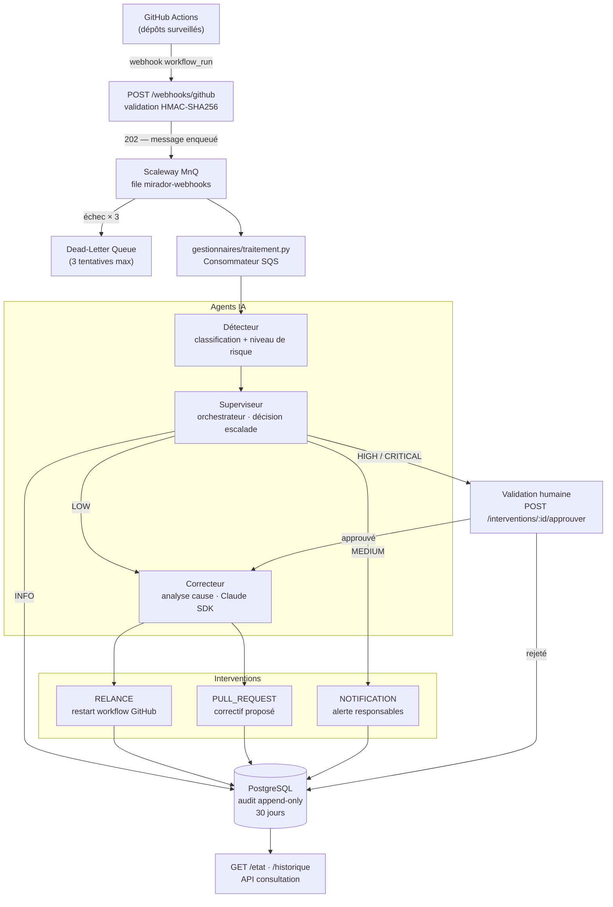

# Mirador

Surveillance autonome de pipelines CI/CD GitHub Actions avec agents IA.

Mirador écoute les événements GitHub Actions, détecte les anomalies, les classe par niveau de risque et applique des corrections automatiques — ou escalade vers validation humaine pour les cas critiques.

---

## Architecture



### Niveaux de risque et actions

| Niveau | Déclencheur | Action automatique |
|--------|-------------|-------------------|
| `INFO` | Événement normal | Journalisation uniquement |
| `LOW` | Échec isolé, pattern connu | Relance automatique |
| `MEDIUM` | Échec répété ou inattendu | Notification + attente |
| `HIGH` | Régression ou impact étendu | Validation humaine requise |
| `CRITICAL` | Incident de production | Validation humaine requise |

---

## Stack technique

- **Runtime** : Python 3.12 — Scaleway Serverless Functions (scale-to-zero)
- **File de messages** : Scaleway MnQ (SQS-compatible, boto3)
- **Stockage** : PostgreSQL managé Scaleway — audit append-only enforced par trigger SQL
- **Auth GitHub** : GitHub App — JWT RSA-256, tokens d'installation à durée limitée
- **Agent IA** : Claude SDK (`anthropic`) — analyse logs, génération correctifs
- **API** : FastAPI — webhooks entrants + consultation état/historique
- **Observabilité** : `structlog` JSON + `correlation_id` UUID sur chaque événement

---

## Lancement local

```bash
python3.12 -m venv .venv
.venv/bin/pip install -e ".[dev]"
.venv/bin/pytest tests/ -v
```

---

## Périmètre v1

1 à 5 dépôts GitHub surveillés simultanément. Interventions limitées à la relance de workflow et l'ouverture de PR — aucun commit direct.
