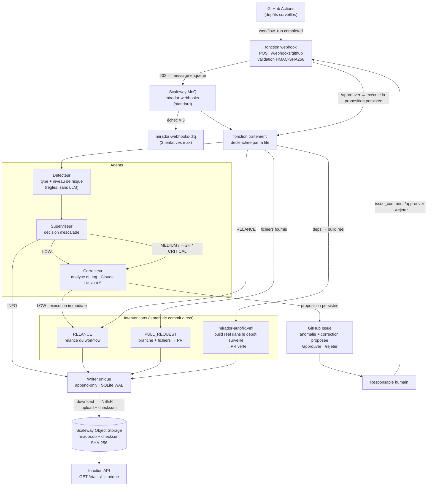

# Mirador

Surveillance autonome de pipelines CI/CD GitHub Actions avec agents IA.

Mirador écoute les événements GitHub Actions, détecte les anomalies, les classe par niveau de risque et applique des corrections automatiques — ou escalade vers validation humaine pour les cas critiques.

**État** : déployé et validé de bout en bout en production sur des dépôts réels — détection d'un échec, ouverture d'une Issue portant la correction proposée, puis `/approuver` qui matérialise une vraie pull request.

---

## Architecture



### Niveaux de risque et actions

Le niveau est décidé par le **Détecteur** (règles déterministes, sans appel LLM) ; le **Superviseur** en déduit l'action.

| Niveau | Déclencheur | Action |
|--------|-------------|--------|
| `INFO` | Événement normal | Journalisation uniquement |
| `LOW` | Échec isolé, pattern connu | Intervention automatique immédiate |
| `MEDIUM` | Échec inattendu | **Issue** + attente de validation |
| `HIGH` | Timeout, ou impact sur la branche par défaut | **Issue** + attente de validation |
| `CRITICAL` | Incident de production | **Issue** + attente de validation |

`MEDIUM` ouvre bien une Issue, au même titre que `HIGH` et `CRITICAL` : la seule différence est la formulation. Seul `LOW` agit sans demander l'avis d'un humain.

### Boucle de validation humaine

1. L'escalade appelle le Correcteur, **persiste** sa proposition dans le journal d'audit, et ouvre une Issue qui l'affiche.
2. Un responsable commente `/approuver` ou `/rejeter <motif>` — l'identité est vérifiée contre les `responsables` du dépôt.
3. `/approuver` relit la proposition persistée et **l'exécute réellement** :
   - **mise à jour de dépendances Go** → déclenche `mirador-autofix.yml` dans le dépôt surveillé, qui régénère `go.mod`/`go.sum` par un **vrai build** et ouvre la PR (seule voie pour un correctif qui passe la CI — `go.sum` n'est pas calculable sans build) ;
   - **fichiers fournis** → crée la branche `mirador/fix-<run>`, écrit les fichiers, ouvre la PR ;
   - sinon → PR documentaire (`MIRADOR-FIX.md`) à compléter par un humain.
4. Si l'exécution échoue, l'approbation reste valable : l'issue est fermée avec un message honnête plutôt qu'un plantage.

**Si le Correcteur est indisponible** (panne API, crédits épuisés), l'Issue est ouverte **quand même**, en signalant « Analyse indisponible ». La détection ne dépend pas de la disponibilité de Claude.

---

## Stack technique

- **Runtime** : Python 3.12 — Scaleway Serverless Functions (scale-to-zero). Le runtime est **Alpine/musl** : les dépendances sont vendorisées en wheels `musllinux` dans le zip, car le déploiement bas-niveau ne construit pas `requirements.txt`.
- **File de messages** : Scaleway MnQ (SQS-compatible, boto3) — `mirador-webhooks` + sa DLQ. File **standard**, pas FIFO : les triggers Scaleway `scw_sqs` ne consomment pas les files FIFO. L'idempotence repose donc sur une déduplication par `delivery_id`.
- **Stockage** : SQLite en mode WAL, persisté dans un bucket Scaleway Object Storage (~€0,02/mois) — audit append-only garanti par un writer unique (`max-scale=1`, INSERT-only, checksum SHA-256).
- **Auth GitHub** : GitHub App — JWT RS256, tokens d'installation à durée limitée (nécessite `PyJWT[crypto]`).
- **Agent IA** : SDK `anthropic` — Claude Haiku 4.5, sortie structurée `json_schema`.
- **API** : FastAPI — webhooks entrants + consultation état/historique.
- **Observabilité** : `structlog` JSON + `correlation_id` UUID sur chaque événement.

---

## Lancement local

```bash
python3.12 -m venv .venv
.venv/bin/pip install -e ".[dev]"
.venv/bin/pytest tests/ -v
```

Développement en **TDD strict** : le test échoue avant que le code existe.

---

## Configuration et déploiement

**Les déploiements passent uniquement par les workflows GitHub Actions** — jamais depuis un poste. Les scripts de `infra/scaleway/` restent utiles en diagnostic, mais ne doivent pas servir à écrire en production.

| Workflow | Rôle | Déclenchement |
|---|---|---|
| `deploy.yml` | Met à jour le **code** des fonctions | Push sur `master` touchant `src/`, `handler.py`, `requirements.txt` (ou à la main) |
| `deploy-config.yml` | Pose l'**environnement + les secrets** | À la main, après modification d'une Variable ou d'un Secret |

La source de vérité de la configuration est constituée des **Variables et Secrets GitHub Actions** du dépôt (Settings → Secrets and variables → Actions).

Variables (non sensibles) : `MIRADOR_DEPOTS`, `BUCKET_NAME`, `S3_ENDPOINT_URL`, `SQS_ENDPOINT_URL`, `SQS_QUEUE_URL`, `AWS_REGION`, `APP_ID`.

Secrets : `APP_PRIVATE_KEY`, `WEBHOOK_SECRET`, `ANTHROPIC_API_KEY`, `AWS_ACCESS_KEY_ID`, `AWS_SECRET_ACCESS_KEY`, `MNQ_ACCESS_KEY`, `MNQ_SECRET_KEY`, plus `SCW_ACCESS_KEY`, `SCW_SECRET_KEY`, `SCW_PROJECT_ID` pour le déploiement.

> Le préfixe `GITHUB_` est réservé par GitHub Actions. D'où `APP_ID` / `APP_PRIVATE_KEY` côté GitHub, que `deploy-config.yml` remappe en `GITHUB_APP_ID` / `GITHUB_APP_PRIVATE_KEY` côté Scaleway.

> Les credentials MnQ (`MNQ_*`, file de messages) sont **distinctes** des credentials Object Storage (`AWS_*`, bucket). Ce ne sont pas les mêmes clés.

### Surveiller un nouveau dépôt

1. Vérifier que la **GitHub App est installée** sur le dépôt (sinon aucun webhook n'arrive).
2. Ajouter une entrée à la Variable `MIRADOR_DEPOTS` :

```json
{"identifiant_github":"proprietaire/depot","installation_id":145689603,"responsables":["aboigues"],"seuil_timeout_secondes":600,"regles":[]}
```

3. Lancer `deploy-config.yml`.

`seuil_timeout_secondes` se cale sur les durées réelles du dépôt : il requalifie en `TIMEOUT` un échec anormalement lent. Trop bas, il transforme un échec ordinaire en alerte ; il n'a aucun effet sur la détection des échecs eux-mêmes.

Pour que `/approuver` puisse matérialiser un correctif de dépendances, copier `infra/depot-surveille/mirador-autofix.yml` dans le dépôt surveillé et autoriser Actions à créer des PR (Settings → Actions → *Allow GitHub Actions to create and approve pull requests*).

---

## Sécurité des secrets

- **Aucun secret dans l'arbre de travail.** Le miroir local vit dans
  `~/.config/mirador/secrets.env` (surchargeable par `MIRADOR_SECRETS`), la clé de la
  GitHub App dans `~/.config/mirador/*.pem`. La source de vérité reste les
  Secrets/Variables GitHub Actions.
- **Hook pre-commit gitleaks**, à installer une fois par clone :
  `pip install -e ".[dev]" && pre-commit install`. Il refuse tout commit contenant un
  secret, quel que soit le nom du fichier.
- **Job CI `secrets`** : gitleaks rescanne tout l'historique à chaque push. C'est le filet
  si le hook a été contourné (`--no-verify`) ou n'est pas installé.
- Exceptions justifiées : `.gitleaks.toml`.
- Limite connue : la configuration par défaut de gitleaks ne lit pas certaines extensions
  binaires (`.bin`, images…). Les swap vim, `.dat`, `.db` et `.sqlite` sont bien analysés.

## Périmètre v1

Quelques dépôts GitHub surveillés simultanément. Interventions limitées à la relance de workflow et à l'ouverture de PR — **aucun commit direct** (Principe III).
